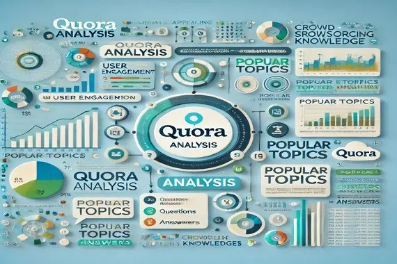

# QUORA ANALYSIS

> 

## Introduction
The main focus of this project is to analyze text and extract new features to identify similarity among a pair of questions.

## Business Problem

Quora is an online Q&A platform where multiple questions with the same intent are often asked. To improve user experience, Quora aims to identify similar question pairs in order to reduce duplicate content and provide better content recommendations.

## Dataset
> https://www.kaggle.com/competitions/quora-question-pairs/data 

 The dataset used for this analysis is publicly available on Kaggle. It contains 6 columns; ‘id’, ‘qid1’, ‘qid2’, ‘question1’, ‘question2’ and ‘is_duplicate’. 

id - It represents the unique identifier for each row in the dataset.

qid1 - It is an identification number assigned to the first question between a pair of two questions.

qid2 - It is an identification number assigned to the second question between a pair of two questions.

is_duplicate - It is a target column that has a pre-determined value (0 or 1) indicating whether a pair of questions is similar or non-similar.

### Assumptions:

1. The dataset used for analysis is representative of the real-world questions and answers on the Quora platform.
2. The main focus is on the analysis of text features and not on the predictions.
3. A random sample of the dataset is representative of the entire dataset.

### Research Questions

1. Do question lengths (both characters and words) determine if they are similar to each other or not?
2. How does the presence of common words determine the similarity among the questions?
3. What is the influence of tokens and stop words on the semantic meaning of the questions?

### Hypothesis

1. Questions having equal length tend to have the same underlying meaning.
2. Having more common words in a question pair increases the chance of it being a duplicate pair.
3. Questions having the same first word can be duplicates of each other.
4. Having the same last words can increase the chance of questions being duplicates of each other.

### **Work Flow**

Import libraries —> Load the dataset —> Exploratory Data Analysis —> Feature Extraction and Feature Engineering —> Draw insights —> Conclusion

## Implementation
The project has been implemented using Python  
It is available in this repository  
> [Jupyter Notebook](https://github.com/aashritha-nelavelli/Quora_Analysis/blob/main/quorafile.ipynb)  

Hope this repository was helpful!  
Do star the repository incase you liked it.  
Thank You :)
